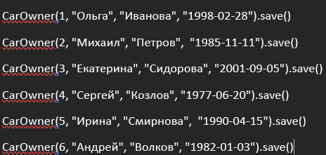
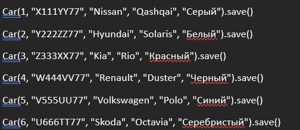
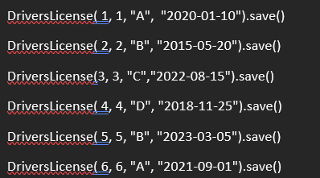
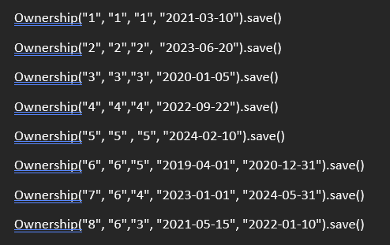
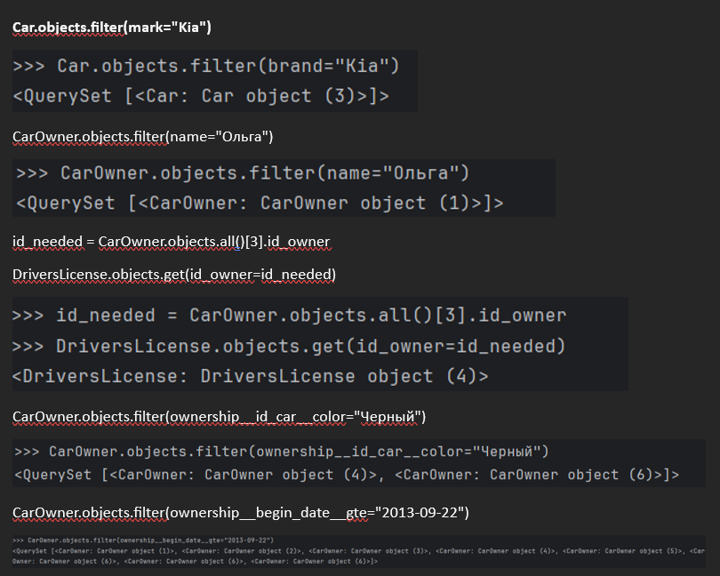
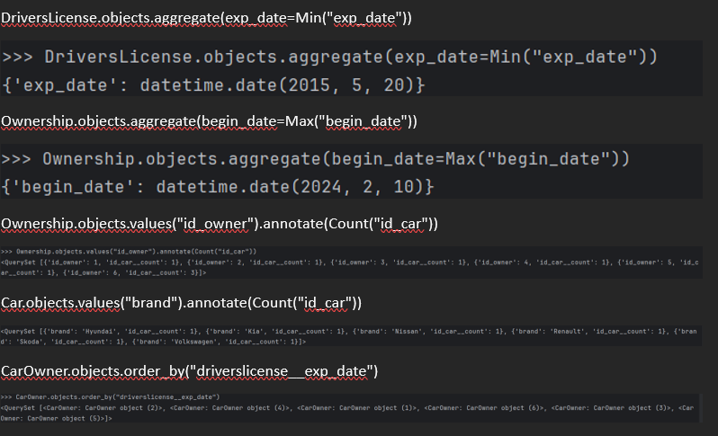

# Практическая работа 3.1

## Текст задания

Напишите запрос на создание 6-7 новых автовладельцев и 5-6 автомобилей, каждому автовладельцу назначьте удостоверение и от 1 до 3 автомобилей. Задание можете выполнить либо в интерактивном режиме интерпретатора, либо в отдельном python-файле. Результатом должны стать запросы и отображение созданных объектов.

### Автовладельцы

### Автомобили

### Удостоверения

### Автомобили автовладельцам

## Текст задания 2
По созданным в пр.1 данным написать следующие запросы на фильтрацию.

## Запросы

## Текст задания 3
Необходимо реализовать следующие запросы c применением описанных методов.

## Запросы

